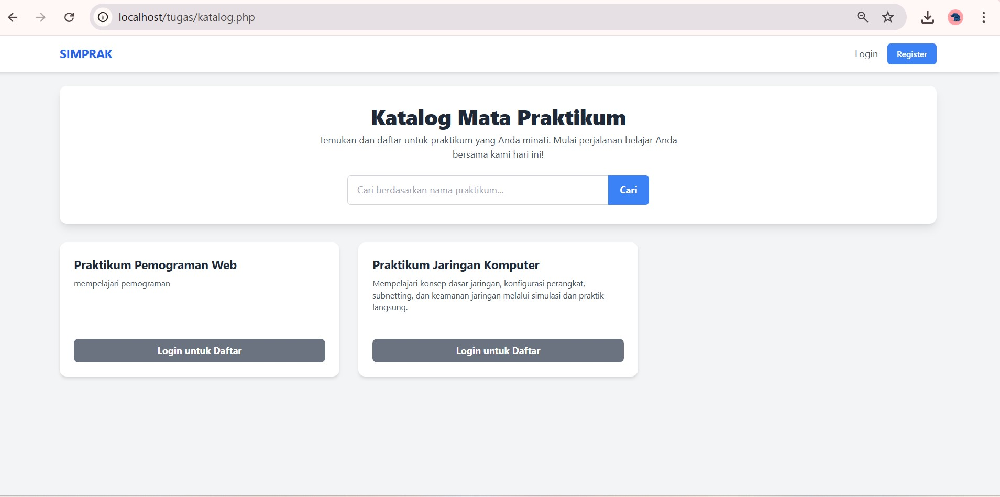
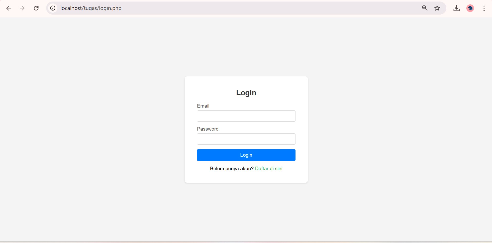
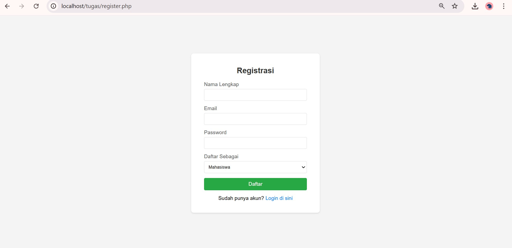
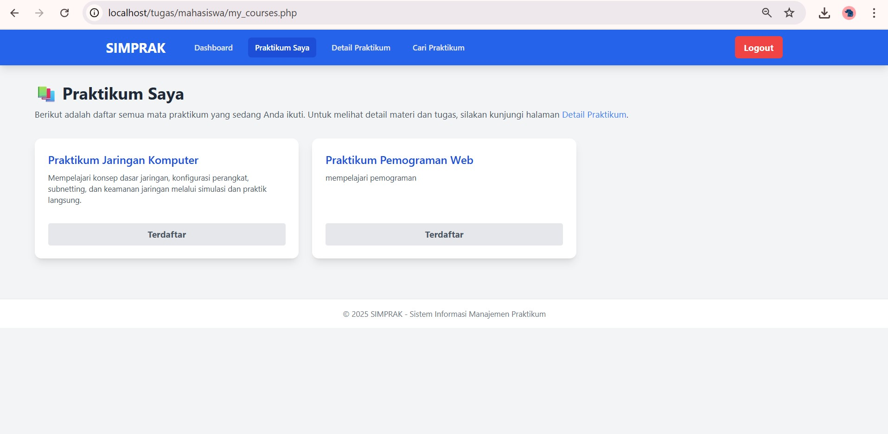
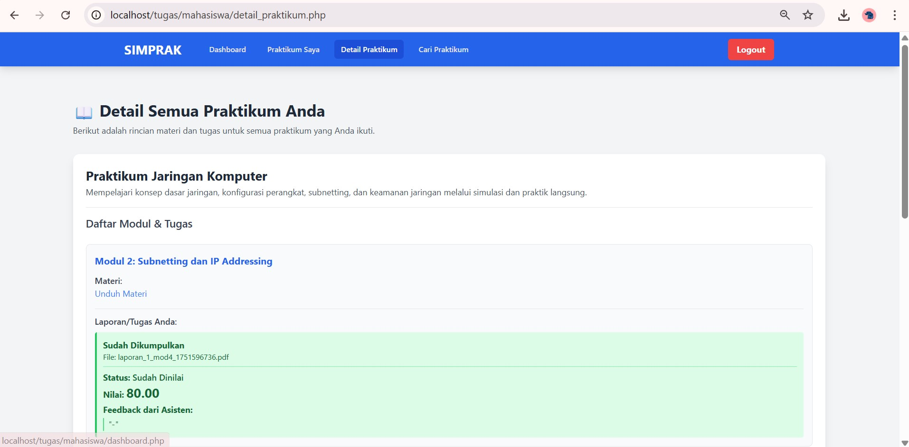
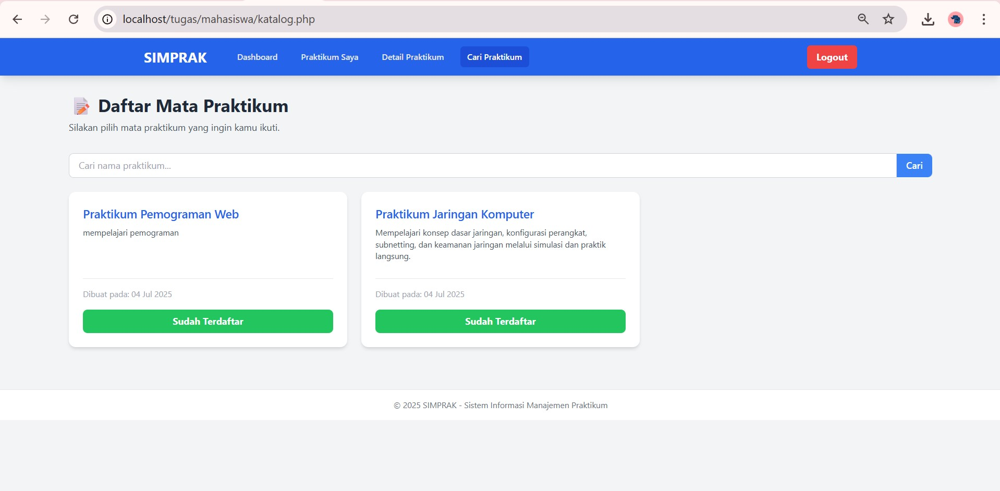
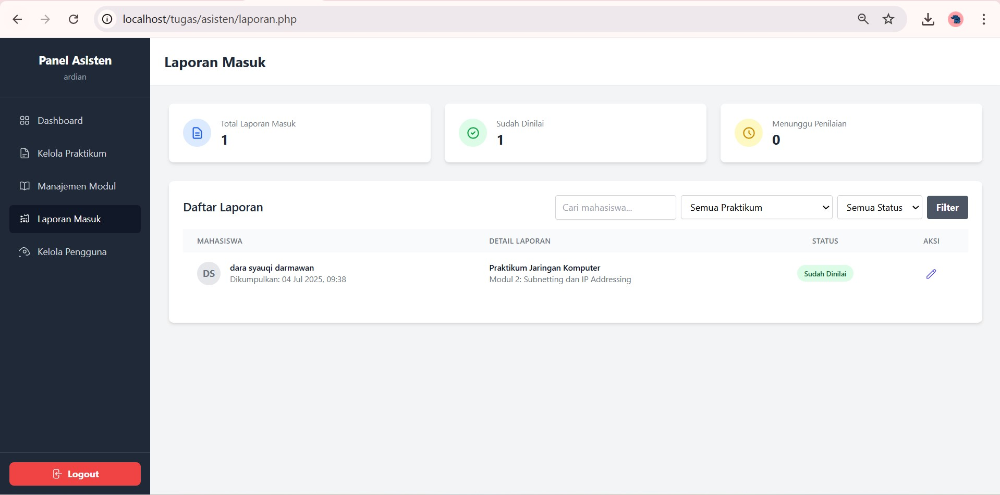
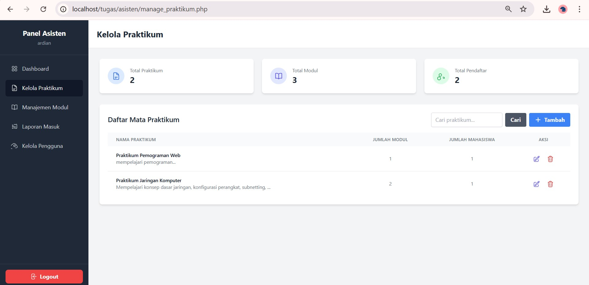
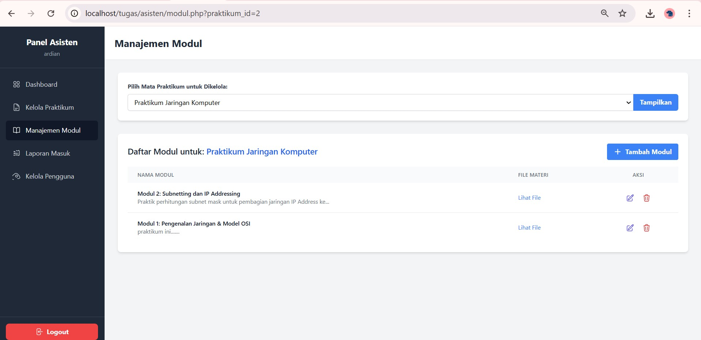
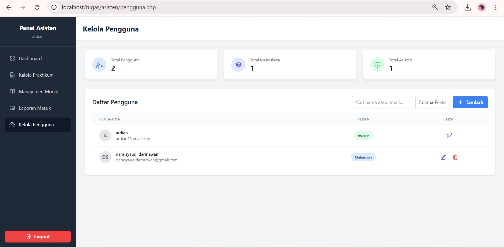

# 20230140140_UAS_PDW
# Proyek UAS: SIMPRAK - Sistem Informasi Manajemen Praktikum

## Tampilan Antarmuka (UI) Aplikasi

Berikut adalah dokumentasi visual dari semua fungsionalitas utama yang telah diimplementasikan dalam aplikasi SIMPRAK, diurutkan berdasarkan alur pengguna.

### Bagian 1: Tampilan Publik & Autentikasi

Tampilan ini dapat diakses oleh siapa saja, baik yang sudah login maupun belum.

#### 1.1. Halaman Utama (Landing Page)
Halaman penyambut yang memberikan informasi umum tentang aplikasi dan menjadi gerbang utama bagi pengguna.

#### 1.2. Halaman Katalog Praktikum
Etalase publik yang menampilkan semua mata praktikum yang tersedia, lengkap dengan fitur pencarian.

#### 1.3. Halaman Login & Registrasi
Formulir bagi pengguna untuk masuk ke sistem atau membuat akun baru.

---

### Bagian 2: Tampilan Mahasiswa

Antarmuka yang dilihat oleh pengguna setelah login dengan peran sebagai **Mahasiswa**.

#### 2.1. Dashboard Mahasiswa
Halaman utama setelah login, berisi ringkasan statistik dan notifikasi terbaru.

#### 2.2. Halaman "Praktikum Saya"
Menampilkan daftar semua praktikum yang sedang atau telah diikuti oleh mahasiswa.

#### 2.3. Halaman Detail Praktikum & Tugas
Halaman komprehensif yang menampilkan semua modul, materi, dan status tugas dari semua praktikum yang diikuti.

#### 2.4 Halaman Katalog Praktikum
Etalase publik yang menampilkan semua mata praktikum yang tersedia, lengkap dengan fitur pencarian

---

### Bagian 3: Tampilan Asisten (Admin)

Antarmuka yang dilihat oleh pengguna setelah login dengan peran sebagai **Asisten**.

#### 3.1. Dashboard Asisten
Halaman utama setelah login, berisi ringkasan statistik laporan yang masuk.

#### 3.2. Halaman Laporan Masuk
Fitur utama asisten untuk melihat semua laporan yang dikumpulkan oleh mahasiswa, lengkap dengan fitur filter.

#### 3.3. Halaman Kelola Mata Praktikum
Fitur bagi asisten untuk menambah, melihat, mengubah, dan menghapus data master mata praktikum (CRUD).

#### 3.4. Halaman Manajemen Modul
Fitur bagi asisten untuk mengelola modul (pertemuan) untuk setiap praktikum.

#### 3.5. Halaman Kelola Pengguna
Fitur bagi asisten untuk mengelola semua akun pengguna yang terdaftar di sistem.

