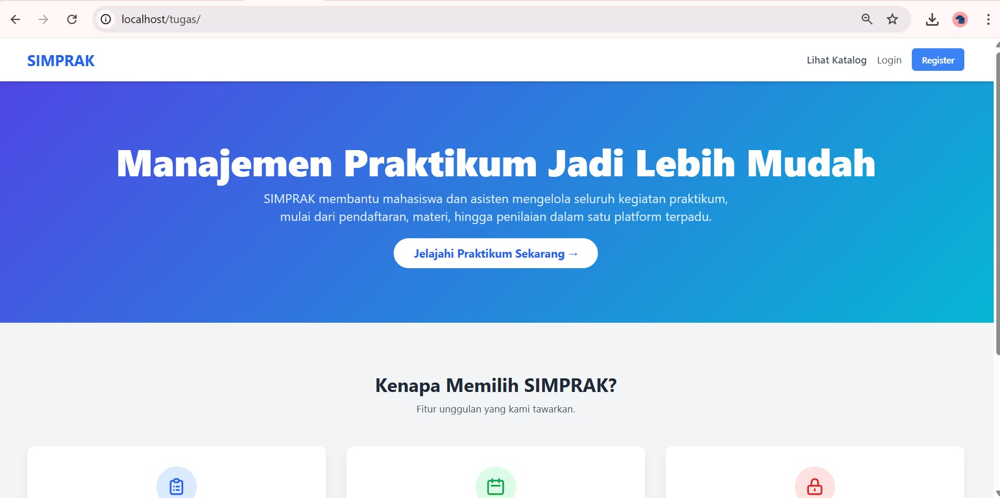
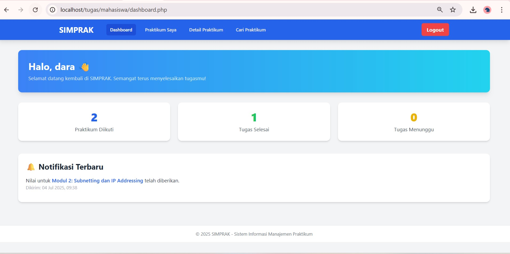
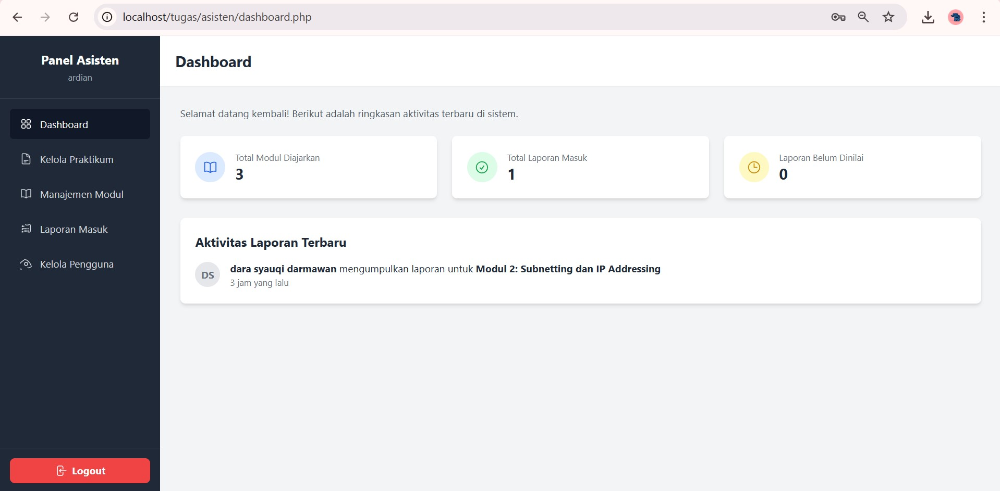

# 20230140140_UAS_PDW
# Proyek UAS: SIMPRAK - Sistem Informasi Manajemen Praktikum

## Tampilan Utama Antarmuka (UI)

Berikut adalah beberapa contoh tampilan utama dari aplikasi SIMPRAK yang telah dibuat.

### 1. Halaman Utama (Landing Page)

Ini adalah halaman penyambut yang dilihat pertama kali oleh semua pengguna. Halaman ini bersifat publik dan memberikan gambaran umum tentang aplikasi serta menyediakan navigasi untuk login atau register.

### 2. Dashboard Mahasiswa

Setelah login, mahasiswa akan diarahkan ke halaman dashboard personal ini. Halaman ini berisi ringkasan aktivitas, seperti jumlah praktikum yang diikuti dan notifikasi terbaru mengenai nilai yang telah diberikan oleh asisten.

### 3. Dashboard Asisten

Halaman utama untuk pengguna dengan peran sebagai asisten (admin). Dashboard ini menampilkan statistik penting seperti jumlah total laporan yang masuk, jumlah yang sudah dinilai, dan yang masih menunggu penilaian. Dari sini, asisten dapat mengakses semua fitur manajemen.

